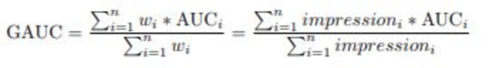

在互联网的排序业务中，比如搜索、推荐、广告等，AUC（Area under the Curve of ROC）是一个非常常见的评估指标。
网上关于AUC的资料很多，知乎上也有不少精彩的讨论，本文尝试基于自身对AUC的理解做个综述，水平有限，欢迎指出错误。
俗话说，提出正确的问题就成功了一半，本文先提出以下几个问题，希望大家读完能够加深对下列问题的理解。

AUC有几种理解？
AUC的什么特性让它如此受欢迎？
AUC的值和什么有关，多高是高？
AUC提高了是否代表线上指标会提高？
有没有更好的指标替代AUC？

### 几种AUC的理解

一般有两大类解释，一种是基于ROC线下面积，需要理解混淆矩阵，包括精确率、召回率、F1 值、ROC等指标的含义。另外一种是基于概率的解释，模型的排序能力。

在参考[1]和[4]中，关于AUC定义本身的讨论非常详细，上述两大类都有不同形式的解释。还包括如何用AUC做目标去优化，AUC的各种计算方法，本文不再赘述，有兴趣的同学自己去看下。

### AUC的排序特性

对比accuracy、precision等指标，AUC指标本身和模型预测score绝对值无关，只关注排序效果，因此特别适合排序业务。

为何与模型预测score值无关为何是很好的特性呢？假设你采用precision、F1等指标，而模型预测的score是个概率值，就必须选择一个阈值来决定哪些样本预测是1哪些是0，不同的阈值选择，precision的值会不同，而AUC可以直接使用score本身，参考的是相对顺序，更加好用。

相对于ROC线下面积的解释，个人更喜欢排序能力的解释。参考[2]的解释通俗易懂：

例如0.7的AUC，其含义可以大概理解为：给定一个正样本和一个负样本，在70%的情况下，模型对正样本的打分高于对负样本的打分。可以看出在这个解释下，我们关心的只有正负样本之间的分数高低，而具体的分值则无关紧要。

AUC对均匀正负样本采样不敏感

正由于AUC对分值本身不敏感，故常见的正负样本采样，并不会导致auc的变化。比如在点击率预估中，处于计算资源的考虑，有时候会对负样本做负采样，但由于采样完后并不影响正负样本的顺序分布。

即假设采样是随机的，采样完成后，给定一条正样本，模型预测为score1，由于采样随机，则大于score1的负样本和小于score1的负样本的比例不会发生变化。

但如果采样不是均匀的，比如采用word2vec的negative sample，其负样本更偏向于从热门样本中采样，则会发现auc值发生剧烈变化。

### AUC值本身有何意义

我们在实际业务中，常常会发现点击率模型的auc要低于购买转化率模型的auc。正如前文所提，AUC代表模型预估样本之间的排序关系，即正负样本之间预测的gap越大，auc越大。

通常，点击行为的成本要低于购买行为，从业务上理解，点击率模型中正负样本的差别要小于购买力模型，即购买转化模型的正样本通常更容易被预测准。

细心的童鞋会想，既然AUC的值和业务数据本身有关，那么它的值为多少的时候算好呢？

AUC值本身的理论上限

假设我们拥有一个无比强大的模型，可以准确预测每一条样本的概率，那么该模型的AUC是否为1呢？现实常常很残酷，样本数据中本身就会存在大量的歧义样本，即特征集合完全一致，但label却不同。因此就算拥有如此强大的模型，也不能让AUC为1.

因此，当我们拿到样本数据时，第一步应该看看有多少样本是特征重复，但label不同，这部分的比率越大，代表其“必须犯的错误”越多。学术上称它们为Bayes Error Rate，也可以从不可优化的角度去理解。

我们花了大量精力做的特征工程，很大程度上在缓解这个问题。当增加一个特征时，观察下时候减少样本中的BER，可作为特征构建的一个参考指标。

### AUC与线上业务指标的宏观关系

AUC毕竟是线下离线评估指标，与线上真实业务指标有差别。差别越小则AUC的参考性越高。比如上文提到的点击率模型和购买转化率模型，虽然购买转化率模型的AUC会高于点击率模型，但往往都是点击率模型更容易做，线上效果更好。

购买决策比点击决策过程长、成本重，且用户购买决策受很多场外因素影响，比如预算不够、在别的平台找到更便宜的了、知乎上看了评测觉得不好等等原因，这部分信息无法收集到，导致最终样本包含的信息缺少较大，模型的离线AUC与线上业务指标差异变大。

总结起来，样本数据包含的信息越接近线上，则离线指标与线上指标gap越小。而决策链路越长，信息丢失就越多，则更难做到线下线上一致。

### AUC提升和业务指标不一致

好在实际的工作中，常常是模型迭代的auc比较，即新模型比老模型auc高，代表新模型对正负样本的排序能力比老模型好。理论上，这个时候上线abtest，应该能看到ctr之类的线上指标增长。

实际上经常会发生不一致，首先，我们得排除一些低级错误：
 -  排除bug，线上线下模型predict的结果要符合预期。
 -  谨防样本穿越。比如样本中有时间序类的特征，但train、test的数据切分没有考虑时间因子，则容易造成穿越。

更多细节请看参考[5]和[3]

### AUC计算逻辑不足与改进

AUC计算是基于模型对全集样本的的排序能力，而真实线上场景，往往只考虑一个用户一个session下的排序关系。这里的gap往往导致一些问题。正如参考[3]中的举例的几个case，比较典型。主要包括两点：

线上会出现新样本，在线下没有见过，造成AUC不足。这部分更多是采用online learning的方式去缓解，AUC本身可改进的不多。

线上的排序发生在一个用户的session下，而线下计算全集AUC，即把user1点击的正样本排序高于user2未点击的负样本是没有实际意义的，但线下auc计算的时候考虑了它。

阿里在论文：Deep Interest Network for Click-Through Rate Prediction中提出了group auc来处理上述问题。

 

即以user为group，在对user的impression做加权平均。私以为，只是对用户做group还不够，应该是基于session去做group。

最后，AUC这个问题是在模型优化到一定程度才需要考虑的。大部分情况下，如果模型的auc有大幅提升，线上效果一般是一致的。如果不一致，请先从产品形态去思考有没有坑。

[如何理解机器学习和统计中的AUC](https://www.zhihu.com/question/39840928)

[多高的AUC才算高](https://zhuanlan.zhihu.com/p/24217322)

[线下AUC提升为什么不能带来线上效果提升？--测试和评估的一些真相](https://zhuanlan.zhihu.com/p/35459467)

[精确率、召回率、F1 值、ROC、AUC 各自的优缺点是什么？](https://www.zhihu.com/question/30643044)

[如何解决离线auc和线上点击率不一致的问题](https://www.zhihu.com/question/305823078/answer/552640544)
