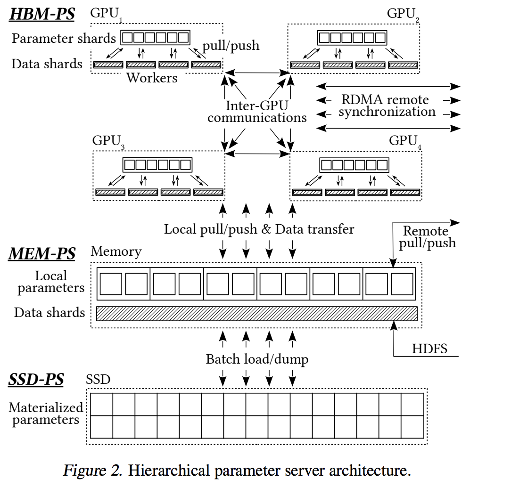
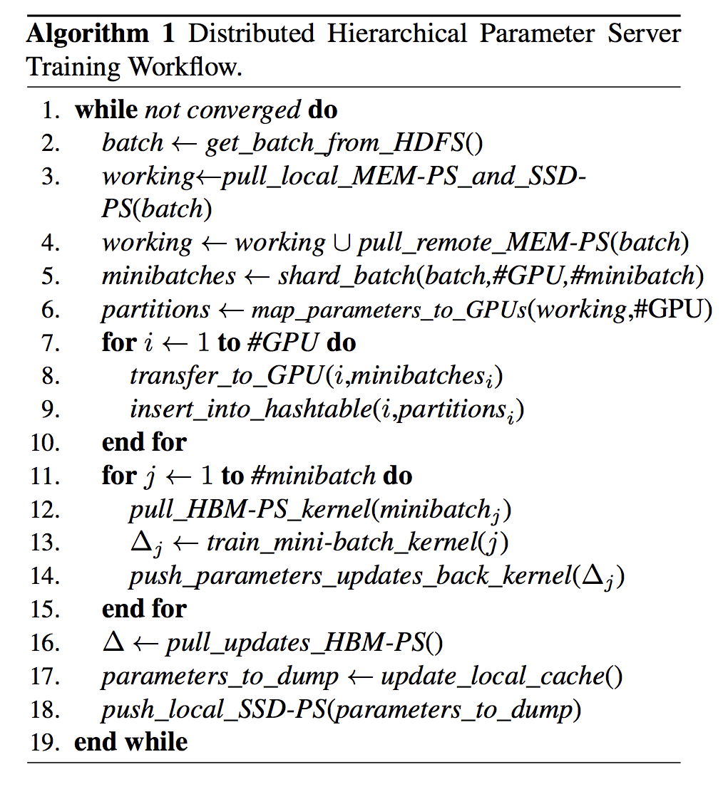
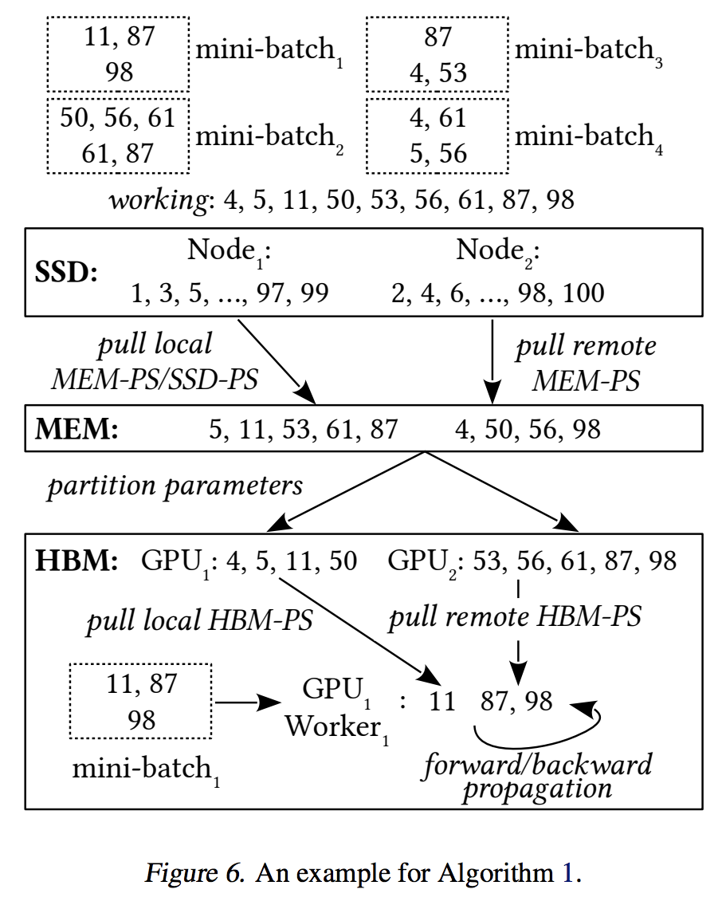
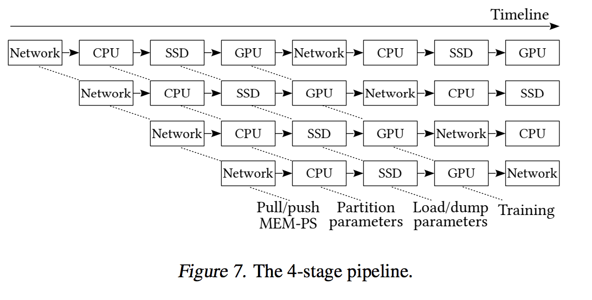
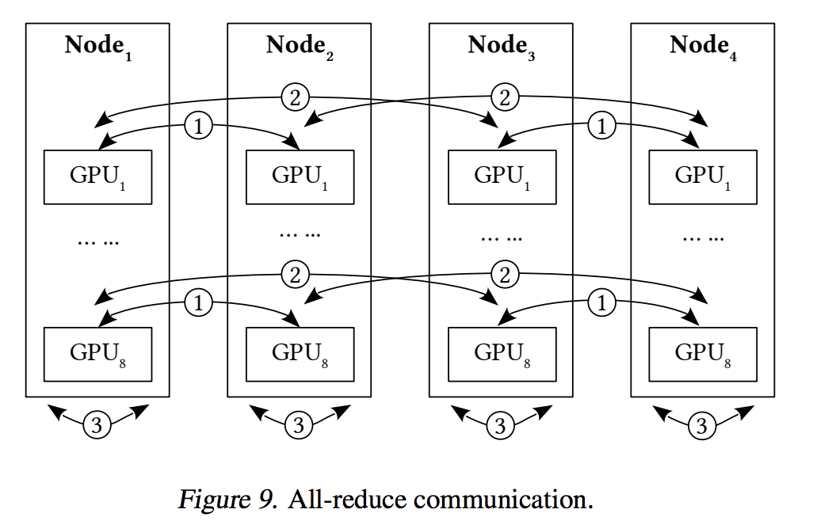
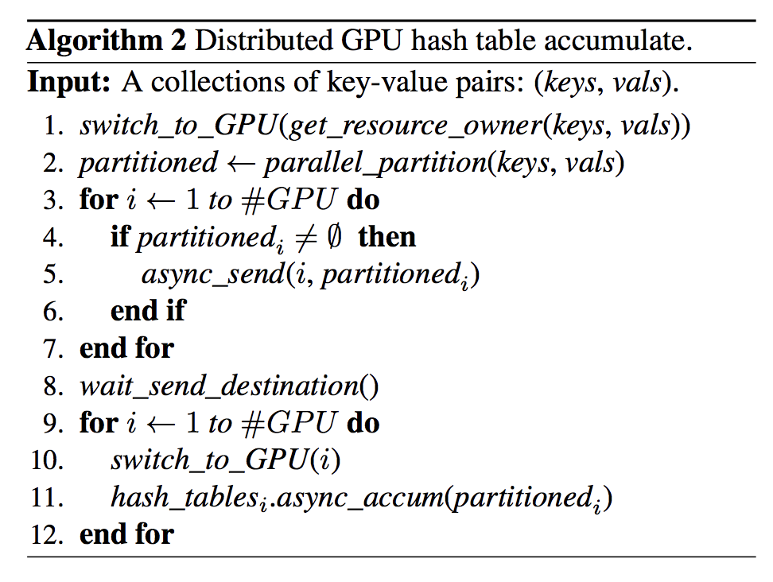
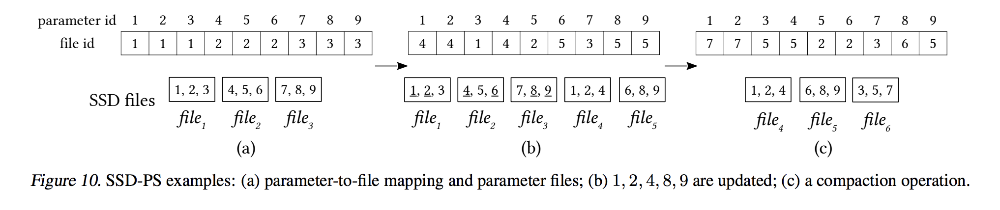

### 机器学习编程框架

ELF：map-reduce框架。对用户提供的主要抽象就是分布式数据流。用户同对一个数据源对象进行一些变换后得到一些新的数据流。最后通过用户将数据流的尾端点加入执行计划。并最终执行来得到结果。

提供了分布式kv存取的操作，但是不是像pull／push这种灵活操作，只能在数据流上做lookup和aggregate，像是加强版的reduce。

Hippo：容错、动态扩缩容。提供了通用的参数服务器。有调度模块、worker模块、ps模块。它的目标是更快（数据按需分配），更省（动态扩缩容），更稳定（容错）。
 - 容错，某一节点出错。其他节点可以继续训练。虽然某些数据可能会重复训练，但实测影响极小。
 - 节点数可以动态变化，比如当执行最后一轮，先跑完的节点先释放掉，ps和worker资源的配置可以不同。当部分worker起来了，作业就可以跑起来了，然后随着新的资源被满足，不断有worker加进来。
 - 每个节点分到一批数据，消费完了再申请。这样的话，对于很慢的节点，它消费的很慢，其他快的节点申请的比它多，一定程度上缓解了慢节点的问题。
 - 当发现有慢节点，把它释放掉，加入黑名单，重新申请新节点。

### 学习率与batch size

[https://www.cnblogs.com/yumoye/p/11055813.html](https://www.cnblogs.com/yumoye/p/11055813.html)

### aibox

[论文地址](https://xujiaqi.org/docs/learn_gpu/paddlebox-Paper.pdf)

先不考虑流水线，流程如下：
 - 训练的batch（对应一个delta的数据，比如10min），从hdfs上读取。训练采用数据并行，每个节点读自己的数据切片。
 - 每个节点从本地的 MEM-PS/SSD-PS和其他节点的MEM-PS拉取batch对应的参数。（本地的MEM-PS会load本地的SSD-PS参数，并请求其他节点的参数）
 - load到MEM-PS之后，会把参数切分到GPU上。（一个参数只会存在于一个GPU上）训练的时候，训练线程通过NVLink直接请求GPU上的参数。
 - 训练是以mini-batch的形式。为了消除dense参数的staleness的问题，每训完一个batch，GPU之间参数会做一次同步。
 - 训练完一个batch后，MEM-PS取出HBM-PS上的更新后的参数，并把低频的参数dump回SSD-PS
 
 

HBM-PS、MEM-PS、SSD-PS是层次的关系，上层相当于是下层的cache。
 - HBM-PS：worker直接与GPU通信，训练吞吐可以显著提高，因为不经过cpu内存。由于HBM容量通常很小，而参数规模很大，层次化的架构可以解决这个问题。
 - MEM-PS：worker计算完前向反向后，MEM-PS取出HBM-PS上的更新后的参数，并把低频的参数dump回SSD-PS，保留高频的参数，可以减少SSD的IO。
 - SSD-PS：SSD的连续读写比随机读写性能更好，因此MEM-PS是按batch把所有参数写到文件里。由后台的compaction线程merge文件。
 
4-stage pipeline：
 - （1） data transfer：network
 - （2） parameter partition：CPU
 - （3） data loading/dumping：SSD
 - （4） neural network training：GPU
 
 

GPU之间参数同步，这里只有四个节点：
 - 相邻节点之间同步（step=1）
 - step=2的节点直接同步
 - GPU内多卡做all reduce

GPU参数更新：

SSD参数更新，顺序写入文件，后台线程定期更新

