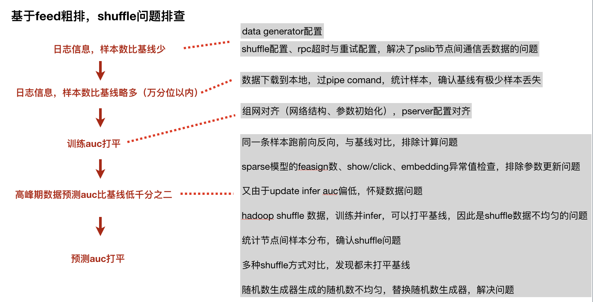
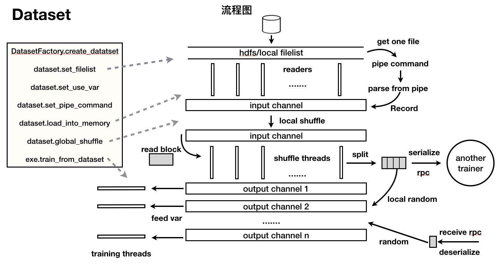

### fleet shuffle排查（效果）

数据量 -> 前向反向计算 -> 梯度更新、feasign数、show／click -> 对比shuffle方式




### fleet 内存

每个样本是 [slot:feasign]\*的格式

原始数据结构
```cpp
struct slot {
  std::vector<float> float_feasign_;
  std::vector<uint64_t> uint64_feasign_;
  std::vector<size_t> offset_;
};

// 一个样本，假如slot个数是408，那么就是
std::vector<slot> sample(408);

// sizeof(slot) = 72字节
// 那么一条样本字节数为 408 * 72
```

现在假设每条样本都是空的，一共100w个样本。那么就是 100w * 72 * 408 / 1024 / 1024 / 1024 = 27.35G

考虑到数据是稀疏格式，可以只用kv对存储slot:feasign格式的数据：

```cpp
union FeatureKey {
  uint64_t uint64_feasign_;
  float float_feasign_;
};
struct FeatureItem {
...
  char sign_[sizeof(FeatureKey)];
  uint16_t slot_;
};
struct Record {
  std::vector<FeatureItem> uint64_feasigns_;
  std::vector<FeatureItem> float_feasigns_;
}

// sizeof(Record) = 48 远小于 408 * 72
```

### fleet 速度优化

考虑通信、overlap、网络结构本身：

通信
 - rpc长尾优化：线程数较多时，不仅调度开销较大，有些线程也可能迟迟未被调度。（bthread）

overlap：
 - pull sparse为同步，可以改为流水线式。 或者对于同一个epoch的多个阶段，不同阶段overlap
 - 数据preload
 - 训练线程均分数据

网络结构本身：
 - 多个阶段合并，共享bottom
 - 及时的stop gradient
 - 减少op数
 

### fleet dataset流程




### 异构

我们考虑cpu、gpu、ssd这三种设备，结合大规模稀疏训练任务。

大规模稀疏参数服务器训练任务的feasign量级都是千亿级别，模型大小可以占到4T，内存也有1.4T。组网比如是一个dnn网络。

纯用cpu机器，可能需要上百台，而gpu的算力更强，可以考虑用gpu做计算。

对于内存，我们也可以考虑使用ssd，将内存作为热点cache。

当然cpu机器还是可以作为worker和server。server依然是作为一个kv存储和更新参数。而cpu worker可以负责下载解析数据和拉取稀疏参数。
gpu worker负责大部分计算图（前向、反向）。对于dense参数而言，可以直接存在gpu worker的cpu内存和gpu显存里，
cpu内存里的参数不断merge梯度+参数更新，周期性的与gpu参数同步。

可以只用几台gpu机器 + 十几台cpu机器，就可以完成原先上百台cpu才能做的训练任务。

gpu机器一般是百G带宽，cpu机器一般是十G带宽。带宽一般是足够用的，训练时候可以灵活调整cpu机器、gpu机器配比，让gpu机器利用率尽可能高一些。
